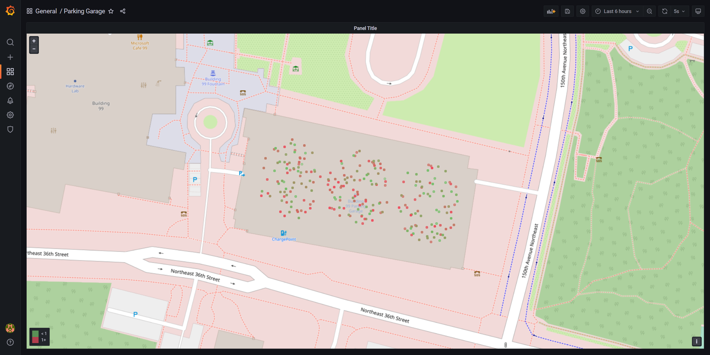
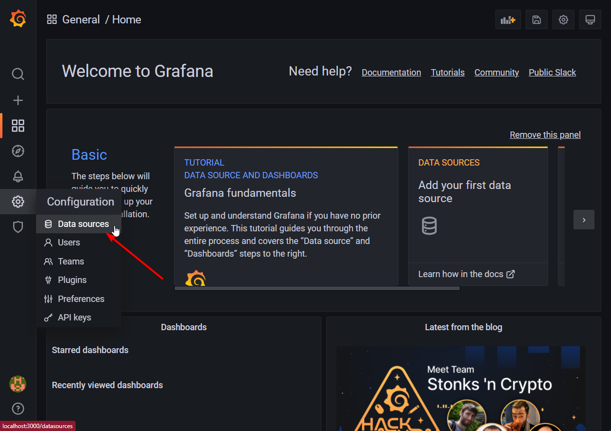
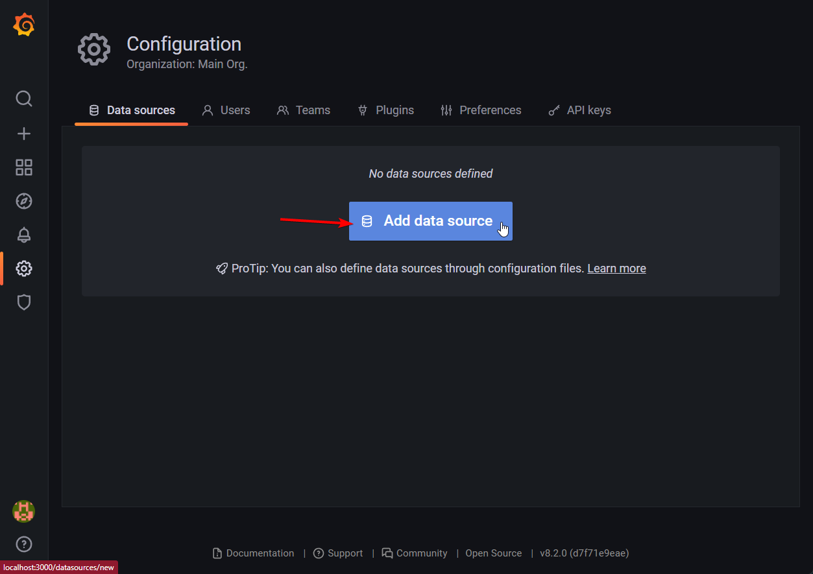
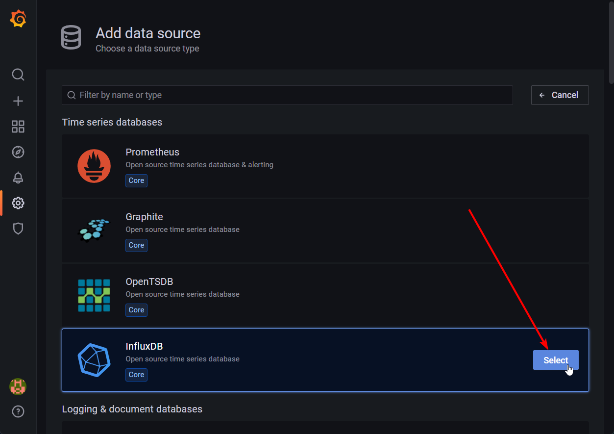
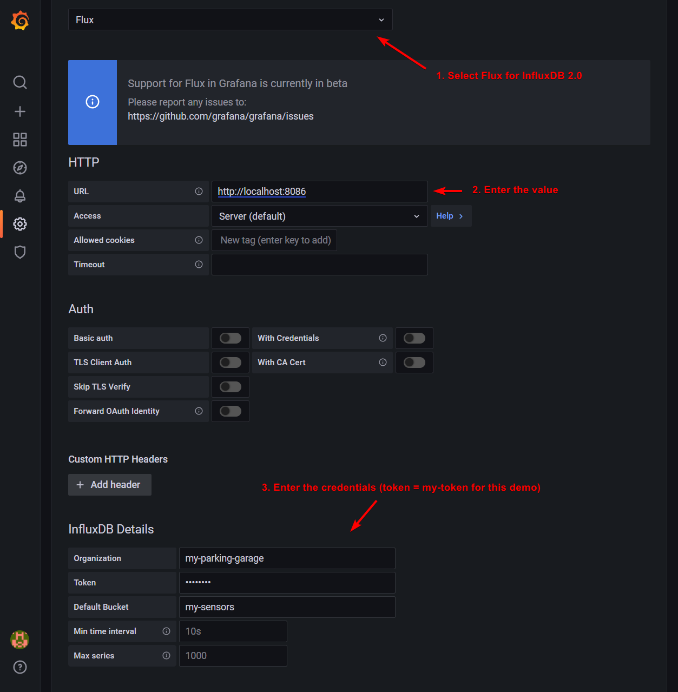
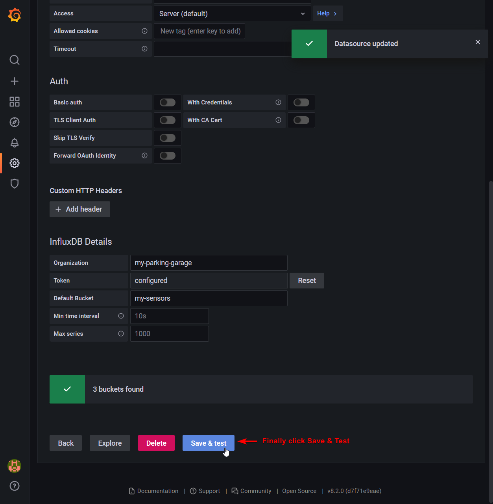
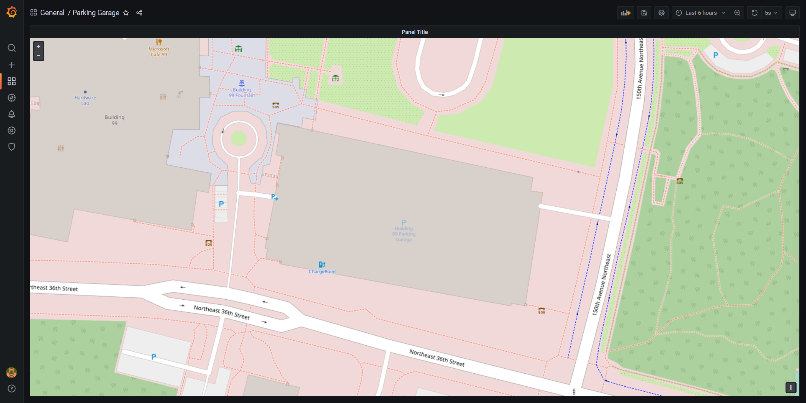

## Scenario
The following example implements a Parking Garage Spot Monitoring System, which can be seen in this [video](https://www.youtube.com/watch?v=eJCu6a-x9uo&t=3785) by Mark Russinovich. In the example, there are two (2) parking garages that can each hold 500 cars. Every parking space has it's own monitoring sensor that provides updates on space availability. If a car drives into a parking space or leaves, an event is dispatched that updates the state of the sensor and that is reflected in the centralized parking monitor system pictured below:   



In this example you will:
- Use the JavaScript SDK to create actors that represent the latest state of a parking sensor.
- Create an Influxdb instance to hold historical sensor data for each parking sensor.
- Create a Grafana dashboard that displays each parking space by color code to indicate whether the parking space is occupied or available.

## Prerequisites
- [Dapr CLI]() installed
- Initialized [Dapr environment]()
- [Docker](https://docs.docker.com/get-docker/) 
- [Latest LTS version of Node or greater](https://nodejs.org/en/)
- [JavaScript NPM package installed](https://www.npmjs.com/package/dapr-client)

### Defining the Actor Interface
You will start this exercise by first defining the parking sensor actor interface. The interface is the shared contract between the actor implementation and the clients calling the actor. In this example, each sensor exposes two (2) methods: `carEnter()` and `carLeave()`. Create a file called `ParkingSensorInterface.ts` and implement the below:

```javascript
export default interface ParkingSensorInterface {
  carEnter(): Promise<void>;
  carLeave(): Promise<void>;
}
```

### Defining the Actor Implementation
The next step is to implement the methods in the interface. The implementation includes logic for both  `carEnter` and `carLeave` methods, as well as additional helper methods. Create the file `ParkingSensorImpl.ts` and add the following implementation. 

#### Steps:

- Define the `onActivate` method which acts as the constructor when the actor is created. This will initialize the mock location of the sensor in the parking garage (latitude and longitude) through the `generateRandomPoint` method.
- Implement the actor interface methods `carEnter` and `carLeave`:
    - carEnter: Will set the actor state to true upon a car parking in the space.
    - carLeave: Will set the state to false upon a car leaving the parking space.
- Add a binding call to influxdb when an actor state changes for storing historical data.
- Add the helper methods `getInfo` and `generateRandomPoint`.

```javascript
import { AbstractActor } from "dapr-client";
import ParkingSensorInterface from "./ParkingSensorInterface";
const STATE_NAME_PARKING_SENSOR_VALUE = "parking-sensor-value";
const STATE_NAME_PARKING_SENSOR_LOCATION_LAT = "parking-sensor-location-lat";
const STATE_NAME_PARKING_SENSOR_LOCATION_LNG = "parking-sensor-location-lng";

const COORDINATES = [
  {
    lat: 47.64167040541433, lng: -122.1398701709982
  },
  {
    lat: 47.64177786440955, lng: -122.14077604924732
  }
]
export default class ParkingSensorImpl extends AbstractActor implements ParkingSensorInterface {
  async carEnter(): Promise<void> {
    await this.getStateManager().setState(STATE_NAME_PARKING_SENSOR_VALUE, true);
    const sensorLocationLat = await this.getStateManager().getState(STATE_NAME_PARKING_SENSOR_LOCATION_LAT);
    const sensorLocationLng = await this.getStateManager().getState(STATE_NAME_PARKING_SENSOR_LOCATION_LNG);
    await this.getDaprClient().binding.send("binding-influxdb", "create", {
      measurement: "sensor-states",
      tags: `sensor=${this.getId().getId()}`,
      values: `lat=${sensorLocationLat},lng=${sensorLocationLng},isParked=1`
    });
  }
  async carLeave(): Promise<void> {
    await this.getStateManager().setState(STATE_NAME_PARKING_SENSOR_VALUE, true);
    const sensorLocationLat = await this.getStateManager().getState(STATE_NAME_PARKING_SENSOR_LOCATION_LAT);
    const sensorLocationLng = await this.getStateManager().getState(STATE_NAME_PARKING_SENSOR_LOCATION_LNG);
    await this.getDaprClient().binding.send("binding-influxdb", "create", {
      measurement: "sensor-states",
      tags: `sensor=${this.getId().getId()}`,
      values: `lat=${sensorLocationLat},lng=${sensorLocationLng},isParked=0`
    });
  }
  async getInfo(): Promise<object> {
    const sensorValue = await this.getStateManager().getState(STATE_NAME_PARKING_SENSOR_VALUE);
    const sensorLocationLat = await this.getStateManager().getState(STATE_NAME_PARKING_SENSOR_LOCATION_LAT);
    const sensorLocationLng = await this.getStateManager().getState(STATE_NAME_PARKING_SENSOR_LOCATION_LNG);
    return {
      sensorValue,
      sensorLocationLat,
      sensorLocationLng
    }
  }
  async onActivate(): Promise<void> {
    const coordIdx = Math.floor(Math.random() * COORDINATES.length);
    const lat = COORDINATES[coordIdx]["lat"];
    const lng = COORDINATES[coordIdx]["lng"];
    const spotLocation = this.generateRandomPoint({ lat, lng }, 20);
    await this.getStateManager().setState(STATE_NAME_PARKING_SENSOR_VALUE, false);
    await this.getStateManager().setState(STATE_NAME_PARKING_SENSOR_LOCATION_LAT, spotLocation.lat);
    await this.getStateManager().setState(STATE_NAME_PARKING_SENSOR_LOCATION_LNG, spotLocation.lng);
  }
  generateRandomPoint(center: { lat: number, lng: number }, radius: number) {
    var x0 = center.lng;
    var y0 = center.lat;
    // Convert Radius from meters to degrees.
    var rd = radius / 111300;
    var u = Math.random();
    var v = Math.random();
    var w = rd * Math.sqrt(u);
    var t = 2 * Math.PI * v;
    var x = w * Math.cos(t);
    var y = w * Math.sin(t);
    var xp = x / Math.cos(y0);
    // Resulting point.
    return { 'lat': y + y0, 'lng': xp + x0 };
  }
}
```

## Creating the application
Now that the parking sensor actor is implemented, the next step is to create the application that calls the actors.

Steps: 
- Register the ParkingSensorActor and start the server.
- Create X amount of actors that represent parking space sensors.
- Randomly set the parking space sensor to active or inactive every 5s.

```javascript
import { DaprServer, DaprClient } from "dapr-client";
import ParkingSensorImpl from "./ParkingSensorImpl";
const daprHost = "127.0.0.1";
const daprPort = "50000"; // Dapr Sidecar Port of this Example Server
const serverHost = "127.0.0.1"; // App Host of this Example Server
const serverPort = "50001"; // App Port of this Example Server

async function sleep(ms: number): Promise<void> {
  return new Promise(resolve => setTimeout(resolve, ms));
}

async function start() {
  const server = new DaprServer(serverHost, serverPort, daprHost, daprPort);
  const client = new DaprClient(daprHost, daprPort);

  console.log("===============================================================");
  console.log("SERVER INITIALIZING")
  console.log("===============================================================");

  await server.actor.init(); // Let the server know we need actors
  server.actor.registerActor(ParkingSensorImpl); // Register the actor
  await server.startServer(); // Start the server

  console.log("===============================================================");
  console.log("CLIENT EXECUTION");
  console.log("===============================================================");

  const amount = 100;
  console.log(`Creating ${amount} Actors`);

  for (let i = 0; i < amount; i++) {
    await client.actor.invoke("GET", ParkingSensorImpl.name, `parking-sensor-${i}`, "getInfo");
  }
  console.log("===============================================================");
  console.log("CHANGING STATE OF SENSORS");
  console.log("===============================================================");
  console.log("Waiting 10 seconds before starting");

  await sleep(10000);

  while (true) {
    console.log("Simulating cars entering and leaving for 5% of the population");
    const populationSize = Math.floor(amount * 0.05);

    // Randomly put 10 on parked
    for (let i = 0; i < populationSize; i++) {
      const id = Math.floor(Math.random() * amount);
      await client.actor.invoke("PUT", ParkingSensorImpl.name, `parking-sensor-${id}`, "carEnter");
    }

    // Randomly put 10 on empty
    for (let i = 0; i < populationSize; i++) {
      const id = Math.floor(Math.random() * amount);
      await client.actor.invoke("PUT", ParkingSensorImpl.name, `parking-sensor-${id}`, "carLeave");
    }

    await sleep(5000);
  }
}
start().catch((e) => {
  console.error(e);
  process.exit(1);
});
```

## Visualization
For the visualization, you will create an `influxdb` and a `Grafana` instance. Use Docker containers to run these instance in a non-persistent way:

```docker
# Run InfluxDB
# Note: it auto removes after shutdown
# Note: non-persistent volume, add "-v influxdb2:/var/lib/influxdb2" to make it persistent
docker run --rm -it -d \
    -e DOCKER_INFLUXDB_INIT_MODE=setup \
    -e DOCKER_INFLUXDB_INIT_USERNAME=admin \
    -e DOCKER_INFLUXDB_INIT_PASSWORD=MyAdmin@123! \
    -e DOCKER_INFLUXDB_INIT_ADMIN_TOKEN=my-token \
    -e DOCKER_INFLUXDB_INIT_ORG=my-parking-garage \
    -e DOCKER_INFLUXDB_INIT_BUCKET=my-sensors \
    --net=host \
    --name influxdb \
    influxdb:2.0

# Run Telegraf
docker run --rm -it -d \
    --net=host \
    --name=telegraf \
    telegraf

# Run Grafana
# Note: non-persistent volume, add "-v influxdb2:/var/lib/influxdb2" to make it persistent
docker run --rm -it -d \
    --name=grafana \
    --net=host \
    grafana/grafana
```
>Note️: the above is not-persistent, add volume binds and remove --rm for them to persist.

## Configuring the Data Source
Next, open `http://localhost:3000` in your browser to navigate to Grafana. Here you will configure a datasource:











### Creating the Dashboard
Above, you configured the data source, so now create your visualization. To keep this simple, there is a pre-configured dashboard that you can import into Grafana:

```json
{
  "annotations": {
    "list": [
      {
        "builtIn": 1,
        "datasource": "-- Grafana --",
        "enable": true,
        "hide": true,
        "iconColor": "rgba(0, 211, 255, 1)",
        "name": "Annotations & Alerts",
        "target": {
          "limit": 100,
          "matchAny": false,
          "tags": [],
          "type": "dashboard"
        },
        "type": "dashboard"
      }
    ]
  },
  "editable": true,
  "fiscalYearStartMonth": 0,
  "gnetId": null,
  "graphTooltip": 0,
  "id": 1,
  "links": [],
  "liveNow": false,
  "panels": [
    {
      "datasource": null,
      "fieldConfig": {
        "defaults": {
          "color": {
            "mode": "thresholds"
          },
          "mappings": [],
          "thresholds": {
            "mode": "absolute",
            "steps": [
              {
                "color": "green",
                "value": null
              },
              {
                "color": "red",
                "value": 1
              }
            ]
          }
        },
        "overrides": []
      },
      "gridPos": {
        "h": 25,
        "w": 24,
        "x": 0,
        "y": 0
      },
      "id": 2,
      "options": {
        "basemap": {
          "config": {},
          "type": "osm-standard"
        },
        "controls": {
          "mouseWheelZoom": true,
          "showAttribution": true,
          "showDebug": false,
          "showScale": false,
          "showZoom": true
        },
        "layers": [
          {
            "config": {
              "color": {
                "field": "isParked",
                "fixed": "dark-green"
              },
              "fillOpacity": 0.4,
              "shape": "circle",
              "showLegend": true,
              "size": {
                "fixed": 3,
                "max": 15,
                "min": 2
              }
            },
            "location": {
              "mode": "auto"
            },
            "type": "markers"
          }
        ],
        "view": {
          "id": "coords",
          "lat": 47.641728,
          "lon": -122.140278,
          "zoom": 19.24
        }
      },
      "targets": [
        {
          "query": "from(bucket: \"my-sensors\")\r\n  |> range(start: v.timeRangeStart, stop: v.timeRangeStop)\r\n  |> filter(fn: (r) => r[\"_measurement\"] == \"sensor-states\")\r\n  |> pivot(columnKey: [\"_field\"], rowKey: [\"_time\"], valueColumn: \"_value\")\r\n  |> group()\r\n  |> yield(name: \"last\")",
          "refId": "A"
        }
      ],
      "title": "Panel Title",
      "type": "geomap"
    }
  ],
  "refresh": "5s",
  "schemaVersion": 31,
  "style": "dark",
  "tags": [],
  "templating": {
    "list": []
  },
  "time": {
    "from": "now-6h",
    "to": "now"
  },
  "timepicker": {},
  "timezone": "",
  "title": "Parking Garage",
  "uid": "Px36rBv7z",
  "version": 5
}
```

For illustration purposes, this is the query that is used to create the visualization:

```bash
from(bucket: "my-sensors")
  |> range(start: v.timeRangeStart, stop: v.timeRangeStop)
  |> filter(fn: (r) => r["_measurement"] == "sensor-states")
  |> pivot(columnKey: ["_field"], rowKey: ["_time"], valueColumn: "_value")
  |> group()
  |> yield(name: "last")
```

### Running the application
Run `npm run start:dapr` on your application to start the example. Open the dashboard and see the results:



